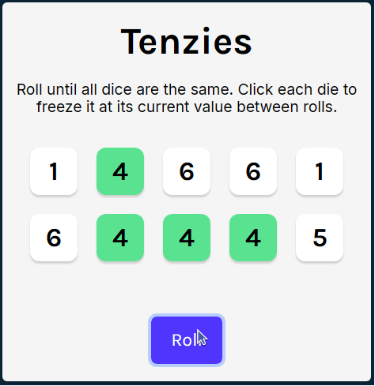

# 🚀 Tenzies
## Capstone Project for Scrimba's Learn React Course
This is a game called Tenzies.
The goal of the game is to roll ten dice till all the dice are the same.

## How to Play
1. Click the "Roll" button to roll the dice.
2. Click on any die to hold it. You can only hold a die if it has the same value as the other held dice.
3. Continue rolling and holding until all the dice are held and have the same value.
4. Once you win, you can click the "New Game" button to start a new game.




🔗 Design in Figma: [Link](https://www.figma.com/design/FqsxRUhAaXM4ezddQK0CdR/Tenzies?node-id=20282-90&t=gLzHbFwOrOk82G8H-0)


---

## 🌍 Demo

- Live: https://mirkobechini.github.io/tenzies/

---

## 🛠️ Tech Stack

- **React**: User Interface
- **CSS**: Styling
- **Vite**: Build tool
- **nanoid**: Unique ID generation for dice
- **react-confetti**: Confetti win animation
- **Figma**: Design

---

## 🚀 Quick Start

### Requirements

Before you begin, ensure you have installed:

- Node.js (v18+)
- npm (included with Node.js)

### Installation

```bash
# Clone the repository
git clone https://github.com/mirkobechini/tenzies.git

# Entra nella cartella del progetto
cd tenzies

# Installa le dipendenze
npm install
```

### Start

```bash
npm run dev
```

Open your browser at `http://localhost:5173`.

---

## 📂 Project Structure

```text
.
|-- src/
|-- public/
|-- readme-images/
|-- README.md
|-- package.json
```

---

## 🗺️ Roadmap

- [x] Setup
- [x] Die Component
- [x] Generate 10 random numbers
- [x] Map array to Die components
- [x] Roll dice button
- [x] Change dice to objects
- [x] Styling held dice
- [x] Hold dice
- [x] End game
- [x] New game
- [x] Accessibility Improvements
- [x] Deploy

---

## 🤝 Contributing

Contributions improve the project. To contribute:

1. Fork the repository
2. Create a branch: `git checkout -b feature/FeatureName`
3. Commit your changes: `git commit -m "Add FeatureName"`
4. Push the branch: `git push origin feature/FeatureName`
5. Open a Pull Request

---

## 📄 License

Distributed under the MIT License. See the `LICENSE` file for details.

---

## 📧 Contact

Mirko Bechini - LinkedIn: (https://www.linkedin.com/in/mirko-bechini-892202252) - mirkobechini@gmail.com

Project link: https://github.com/mirkobechini/tenzies
